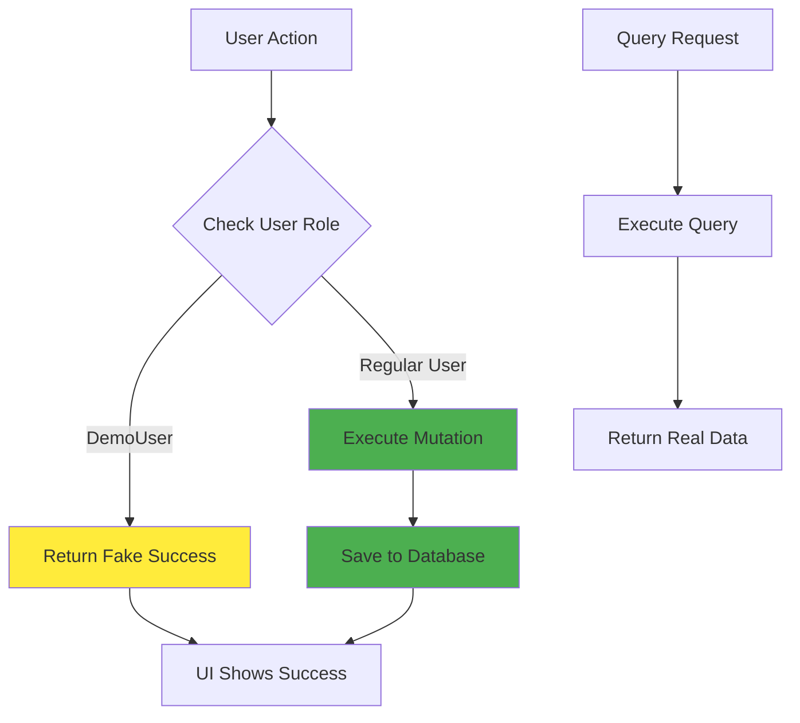

# DemoUser Role Implementation Plan

## Overview

Create a "DemoUser" role that provides full UI functionality but prevents all database mutations from persisting. Mutations will return fake success responses with fake IDs so the UI appears to work normally, while queries remain unchanged for read-only access.

## Architecture



## Implementation Steps

### 1. Extend Role System (`frontend/convex/lib/auth.ts`)

- Add "DemoUser" to role union type in `requireRole()` function
- Create `isDemoUser()` helper function that checks:
  - `user.email === process.env.DEMO_USER_EMAIL` OR
  - `(user as any).role === "demoUser"`
- Export the helper for use in mutations

**Files to modify:**

- `frontend/convex/lib/auth.ts`

### 2. Create Fake ID Generator Utility (`frontend/convex/lib/demoUtils.ts`)

- Create utility function to generate fake Convex IDs that match the expected format
- These IDs will be returned by mutations for DemoUser to make the UI think operations succeeded
- Function signature: `generateFakeId(tableName: string): Id<TableName>`

**Files to create:**

- `frontend/convex/lib/demoUtils.ts`

### 3. Modify Media Mutations (`frontend/convex/mutations/media.ts`)

Update all mutations to check for DemoUser before executing:

- **`create`**: If DemoUser, return fake media object with fake ID instead of inserting
- **`update`**: If DemoUser, return fake updated object instead of patching
- **`deleteMedia`**: If DemoUser, return success without deleting

**Files to modify:**

- `frontend/convex/mutations/media.ts`

### 4. Modify MediaType Mutations (`frontend/convex/mutations/mediaTypes.ts`)

Update all mutations to check for DemoUser:

- **`create`**: Return fake MediaType object with fake ID
- **`update`**: Return fake updated MediaType object
- **`deleteMediaType`**: Return success without deleting

**Files to modify:**

- `frontend/convex/mutations/mediaTypes.ts`

### 5. Modify MediaTag Mutations (`frontend/convex/mutations/mediaTags.ts`)

Update all mutations to check for DemoUser:

- **`create`**: Return fake MediaTag object with fake ID
- **`update`**: Return fake updated MediaTag object
- **`deleteTag`**: Return success without deleting

**Files to modify:**

- `frontend/convex/mutations/mediaTags.ts`

### 6. Modify User Mutations (`frontend/convex/mutations/users.ts`)

Update mutations to check for DemoUser:

- **`updateProfile`**: Return fake success without updating preferences
- **`updateRole`**: Prevent DemoUser from changing roles (already admin-only, but add explicit check)

**Files to modify:**

- `frontend/convex/mutations/users.ts`

### 7. Add DemoUser Query (`frontend/convex/queries/users.ts`)

Create a query to check if current user is DemoUser (for frontend UI indicator):

- **`checkIsDemoUser`**: Returns boolean indicating if current user is DemoUser

**Files to modify:**

- `frontend/convex/queries/users.ts`

### 8. Frontend: Add Demo Mode Indicator (`frontend/src/components/layout/DemoModeBanner.tsx`)

Create a banner component that displays when user is in demo mode:

- Shows at top of application
- Styling: Yellow/orange banner with warning icon
- Text: "Demo Mode: Changes will not be saved"
- Uses `useQuery(api.queries.users.checkIsDemoUser)` to check status

**Files to create:**

- `frontend/src/components/layout/DemoModeBanner.tsx`

### 9. Integrate Demo Banner into App (`frontend/src/App.tsx`)

Add DemoModeBanner component to the main app layout:

- Display at top of application (above Header)
- Only visible when user is DemoUser

**Files to modify:**

- `frontend/src/App.tsx`

### 10. Update Type Definitions

Ensure TypeScript types support the new role:

- Update role union types where needed
- Add DemoUser to any role-related type definitions

**Files to check/modify:**

- `frontend/convex/lib/auth.ts`
- Any frontend type files referencing roles

## Key Implementation Details

### Fake ID Generation

Convex IDs follow a pattern like `j1234567890abcdef`. For fake IDs, we'll generate IDs that:

- Match the expected format
- Are clearly fake (e.g., start with `demo_` prefix or use a specific pattern)
- Won't conflict with real IDs

### Mutation Pattern

All mutations will follow this pattern:

```typescript
handler: async (ctx, args) => {
  const user = await requireAuth(ctx);
  
  // Check if user is DemoUser
  if (await isDemoUser(ctx)) {
    // Return fake success response
    return generateFakeResponse(args);
  }
  
  // Normal mutation logic
  // ... actual database operations
}
```

### Environment Variable Setup

Document that `DEMO_USER_EMAIL` can be set in Convex Dashboard (similar to `ADMIN_EMAIL`):

- Development: Set in Development deployment settings
- Production: Set in Production deployment settings

## Testing Considerations

- Test that DemoUser can use all UI features
- Verify mutations return fake IDs
- Confirm no data is actually saved to database
- Test that queries still return real data
- Verify demo banner appears for DemoUser
- Test role assignment via both env var and user field

## Files Summary

**Files to create:**

- `frontend/convex/lib/demoUtils.ts` - Fake ID generation utilities
- `frontend/src/components/layout/DemoModeBanner.tsx` - Demo mode UI indicator

**Files to modify:**

- `frontend/convex/lib/auth.ts` - Add DemoUser role support
- `frontend/convex/mutations/media.ts` - Add DemoUser checks
- `frontend/convex/mutations/mediaTypes.ts` - Add DemoUser checks
- `frontend/convex/mutations/mediaTags.ts` - Add DemoUser checks
- `frontend/convex/mutations/users.ts` - Add DemoUser checks
- `frontend/convex/queries/users.ts` - Add DemoUser check query
- `frontend/src/App.tsx` - Add demo banner

**Documentation to create:**

- `frontend/DEMO_USER_SETUP.md` - Guide for setting up DemoUser role