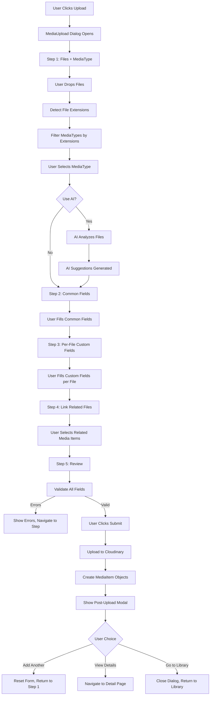

# Media Upload with Multi-Step Form and Cloudinary Integration

## Overview

Build a complete media upload system featuring a 5-step wizard form within a ShadCN Dialog modal, Cloudinary direct browser uploads, AI-powered metadata generation, and support for multiple file uploads with hybrid field management.

## Architecture

```
MediaUpload Dialog (5-Step Wizard)
├── Step 1: Files + MediaType Selection
│   ├── Drag-and-drop zone
│   ├── File preview list
│   ├── MediaType selector (filtered by file extensions)
│   └── AI choice toggle (after MediaType selection)
├── Step 2: Common Fields
│   ├── Title (with AI suggestion)
│   ├── Description (with AI generation)
│   ├── Alt Text (with AI generation)
│   └── Tags (with AI suggestions + MediaType defaults)
├── Step 3: Per-File Custom Fields
│   ├── Accordion list of files
│   ├── Per-file MediaType custom fields
│   └── Batch operations (copy from previous, apply to all)
├── Step 4: Link Related Media Files
│   ├── Search existing media items
│   ├── Multi-select related files
│   └── Per-file related files (optional)
└── Step 5: Review & Submit
    ├── Summary of all files
    ├── Validation check
    └── Final submit button
        ↓
    Cloudinary Upload (per file)
        ↓
    Create MediaItem objects
        ↓
    Post-upload modal (Add Another / View Details / Go to Library)
```

## Step-by-Step Flow

### Step 1: Files + MediaType Selection

**Purpose:** Collect files and determine MediaType for metadata requirements

**Features:**

- Drag-and-drop file zone (full dialog area)
- Click to browse file input
- File preview list with thumbnails/icons
- File validation (type, size)
- Remove file button
- MediaType selector dropdown (appears after files dropped)
- Filter MediaTypes by file extensions
- "None" option for generic uploads
- AI choice toggle/button (appears after MediaType selection)

**File Detection:**

- Extract file extensions from dropped files
- Group files by extension
- Filter MediaTypes that accept any of the file extensions
- If multiple file types, show MediaTypes that accept any of them

**AI Choice UI:**

- After MediaType selection, show: "Use AI to generate metadata?" toggle
- If enabled: Show "Analyzing..." state during AI processing
- If disabled: Skip to Step 2 with empty fields

**State:**

- `files: File[]` - Selected files
- `filePreviews: FilePreview[]` - File preview data with thumbnails
- `selectedMediaType: MediaType | null` - Selected MediaType
- `useAI: boolean` - User's AI preference
- `aiProcessing: boolean` - AI analysis in progress

### Step 2: Common Fields

**Purpose:** Fill standard fields that apply to all files

**Fields:**

- **Title** (required)
  - Single input field
  - If multiple files: Used as prefix (e.g., "Product Photo" → "Product Photo 1", "Product Photo 2")
  - AI suggestion: Based on filename + content analysis
- **Description** (optional)
  - Textarea
  - AI generation: Content-based description
  - Applies to all files
- **Alt Text** (optional)
  - Text input
  - AI generation: Accessibility-focused description
  - Applies to all files
- **Tags** (optional)
  - Multi-select with autocomplete
  - AI suggestions: Content-based tags
  - MediaType default tags: Auto-applied if MediaType selected
  - Applies to all files

**AI Integration:**

- If `useAI` is true, show loading state during analysis
- Pre-populate fields with AI suggestions
- Show "AI Suggestions" badges on pre-filled fields
- "Accept All" / "Reject All" buttons
- Per-field "Regenerate" button

**State:**

- `commonFields: CommonFields` - Shared field values
- `aiSuggestions: AISuggestions` - AI-generated suggestions

### Step 3: Per-File Custom Fields

**Purpose:** Fill MediaType-specific custom fields for each file

**UI Pattern:**

- Accordion/list view of files
- Each file expandable to show custom fields
- Fields rendered dynamically based on selected MediaType
- If no MediaType selected, show message: "Select a MediaType to see custom fields"

**Features:**

- Expand/collapse individual files
- Per-file field forms (generated from MediaType.fields)
- Field validation (required fields, regex patterns)
- "Copy from Previous" button (copies custom fields from previous file)
- "Apply to All" button (applies current file's custom fields to all)
- Visual indicators for required fields
- Field-specific error messages

**State:**

- `perFileFields: Record<string, Record<string, any>>` - Custom field values per file
- `expandedFiles: Set<string>` - Which files are expanded
- `fieldErrors: Record<string, Record<string, string[]>>` - Per-file, per-field errors

### Step 4: Link Related Media Files

**Purpose:** Associate uploaded files with existing media items

**Features:**

- Search input for existing media items
- Media item selector (grid/list view)
- Multi-select related files
- Show selected related files as badges
- Option to link per-file (advanced) or globally (all files)
- Filter by media type, tags, date range

**UI:**

- Search bar with autocomplete
- Media item grid/list (reuse MediaList components)
- Selected items shown as removable badges
- "Link to all files" toggle (default: true)
- Per-file related files section (if toggle off)

**State:**

- `relatedFiles: string[]` - IDs of related media items (global)
- `perFileRelatedFiles: Record<string, string[]>` - Per-file related files (if enabled)

### Step 5: Review & Submit

**Purpose:** Final review before upload

**Features:**

- Summary cards for each file showing:
  - Thumbnail/preview
  - Title (with numbering if multiple)
  - MediaType (if selected)
  - Standard fields summary
  - Custom fields summary
  - Related files count
- Overall validation status
- "Edit" links to jump back to specific steps
- Final submit button
- Upload progress (after submit)

**Validation:**

- Check all required standard fields
- Check all required custom fields per file
- Validate file formats match MediaType (if MediaType selected)
- Show errors grouped by file

**Submit Flow:**

- Disable submit button
- Show "Uploading..." state
- Upload files to Cloudinary sequentially
- Track progress per file
- Create MediaItem objects
- Show success state
- Display post-upload modal

## Implementation Details

### 1. Create Types (`frontend/src/types/upload.ts`)

**New file with upload-specific types:**

```typescript
export interface FilePreview {
  id: string;
  file: File;
  preview: string; // Object URL for thumbnail
  extension: string;
  size: number;
  type: 'image' | 'video' | 'document' | 'audio' | 'other';
}

export interface CommonFields {
  title: string;
  description: string;
  altText: string;
  tags: string[];
}

export interface AISuggestions {
  title?: string;
  description?: string;
  altText?: string;
  tags?: string[];
}

export interface UploadFileData {
  fileId: string;
  mediaTypeId?: string;
  commonFields: CommonFields;
  customFields: Record<string, any>;
  relatedFiles: string[];
}

export interface UploadState {
  step: number;
  files: FilePreview[];
  selectedMediaType: MediaType | null;
  useAI: boolean;
  aiProcessing: boolean;
  aiSuggestions: AISuggestions;
  commonFields: CommonFields;
  perFileFields: Record<string, Record<string, any>>;
  relatedFiles: string[];
  perFileRelatedFiles: Record<string, string[]>;
  errors: Record<string, string[]>;
  uploading: boolean;
  uploadProgress: Record<string, number>;
}
```

### 2. Create Cloudinary Utilities (`frontend/src/lib/cloudinary.ts`)

**Functions:**

- `configureCloudinary()` - Initialize with env vars
- `uploadFile(file: File, options?: UploadOptions): Promise<UploadResult>` - Direct browser upload
- `extractMetadata(publicId: string, resourceType: string): Promise<FileMetadata>` - Get dimensions, duration, etc.
- `validateFile(file: File): ValidationResult` - Check type and size
- `generateThumbnailUrl(publicId: string): string` - Get thumbnail URL

**Configuration:**

- Environment variables: `VITE_CLOUDINARY_CLOUD_NAME`, `VITE_CLOUDINARY_API_KEY`, `VITE_CLOUDINARY_UPLOAD_PRESET`
- File size limits: 100MB default
- Progress tracking via XHR events

### 3. Create AI Utilities (`frontend/src/lib/aiUtils.ts`)

**Functions:**

- `analyzeFileWithAI(file: File, mediaType?: MediaType): Promise<AISuggestions>` - Analyze file and generate suggestions
- `generateTitle(filename: string, contentAnalysis: any): string` - Generate title
- `generateDescription(contentAnalysis: any): string` - Generate description
- `generateAltText(contentAnalysis: any): string` - Generate alt text
- `suggestTags(contentAnalysis: any, mediaType?: MediaType): string[]` - Suggest tags

**Note:** For now, use mock AI responses. Future: Integrate with OpenAI API.

### 4. Create Upload Hook (`frontend/src/hooks/useMediaUpload.ts`)

**State Management:**

- Manage all upload state (files, steps, fields, errors)
- Step navigation logic
- Field validation
- AI processing orchestration
- Cloudinary upload orchestration

**Functions:**

- `addFiles(files: File[])` - Add files and generate previews
- `removeFile(fileId: string)` - Remove file from queue
- `setMediaType(mediaType: MediaType | null)` - Set MediaType and trigger AI if enabled
- `setUseAI(useAI: boolean)` - Toggle AI usage
- `processAI()` - Trigger AI analysis for all files
- `setCommonFields(fields: Partial<CommonFields>)` - Update common fields
- `setPerFileField(fileId: string, fieldName: string, value: any)` - Update custom field
- `setRelatedFiles(files: string[])` - Set related files
- `validateStep(step: number): boolean` - Validate current step
- `nextStep()` - Navigate to next step (with validation)
- `previousStep()` - Navigate to previous step
- `submitUpload()` - Start upload process
- `reset()` - Clear all state

### 5. Create Step Components

**Step1FilesAndMediaType** (`frontend/src/components/media/upload/Step1FilesAndMediaType.tsx`)

- Drag-and-drop zone
- File preview list
- MediaType selector
- AI choice toggle

**Step2CommonFields** (`frontend/src/components/media/upload/Step2CommonFields.tsx`)

- Title input with AI suggestion
- Description textarea with AI generation
- Alt text input with AI generation
- Tags multi-select with AI suggestions
- AI suggestion badges and controls

**Step3PerFileFields** (`frontend/src/components/media/upload/Step3PerFileFields.tsx`)

- File accordion list
- Dynamic field rendering per MediaType
- Copy/apply batch operations
- Field validation

**Step4RelatedFiles** (`frontend/src/components/media/upload/Step4RelatedFiles.tsx`)

- Search input
- Media item selector
- Selected items display
- Global vs per-file toggle

**Step5Review** (`frontend/src/components/media/upload/Step5Review.tsx`)

- File summary cards
- Validation status
- Edit links to steps
- Submit button

### 6. Create Main MediaUpload Component (`frontend/src/components/media/MediaUpload.tsx`)

**Structure:**

- ShadCN Dialog wrapper
- StepIndicator component (reuse from MediaTypeForm)
- Step content area (renders current step component)
- Navigation buttons (Previous/Next)
- Progress indicators

**Props:**

- `open: boolean`
- `onOpenChange: (open: boolean) => void`
- `onUploadComplete?: (files: MediaItem[]) => void`

**State:**

- Uses `useMediaUpload` hook
- Manages dialog visibility
- Handles step navigation

### 7. Create Post-Upload Modal (`frontend/src/components/media/PostUploadModal.tsx`)

**Purpose:** Show success and provide navigation options

**Features:**

- Success message with file count
- Action buttons:
  - "Add Another File" - Reset form, return to Step 1
  - "View Details" - Navigate to detail page of last uploaded file
  - "Go to Library" - Close dialog, return to MediaLibrary
- List of uploaded files (if multiple)
- Individual "View" links per file

### 8. Update MediaItem Interface

**Extend** `frontend/src/lib/mediaUtils.tsx`:

```typescript
export interface MediaItem {
  id: string;
  filename: string;
  thumbnail: string;
  mediaType: MediaType; // Basic type: image/video/etc
  customMediaTypeId?: string; // Link to MediaType if selected
  title: string; // NEW
  description?: string; // NEW
  altText?: string; // NEW
  fileSize: number;
  tags: string[];
  dateModified: Date;
  relatedFiles?: string[]; // NEW - IDs of related media items
  customMetadata?: Record<string, any>; // NEW - Custom field values
  aiGenerated?: boolean; // NEW
}
```

### 9. Create File Preview Utilities (`frontend/src/lib/fileUtils.ts`)

**Functions:**

- `createFilePreview(file: File): Promise<FilePreview>` - Generate preview with thumbnail
- `getFileExtension(file: File): string` - Extract extension
- `getFileType(extension: string): 'image' | 'video' | 'document' | 'audio' | 'other'` - Determine type
- `generateFileId(): string` - Generate unique ID
- `revokePreviewUrl(url: string): void` - Clean up object URLs

### 10. Create Related Files Selector (`frontend/src/components/media/RelatedFilesSelector.tsx`)

**Purpose:** Reusable component for selecting existing media items

**Features:**

- Search input with autocomplete
- Media item grid/list (reuse MediaList/MediaTable components)
- Multi-select with checkboxes
- Selected items display
- Filter by type, tags, date

**Props:**

- `selectedIds: string[]`
- `onChange: (ids: string[]) => void`
- `excludeIds?: string[]` - Exclude current upload files

## Files to Create

1. `frontend/src/types/upload.ts` - Upload-specific TypeScript types
2. `frontend/src/components/ui/dialog.tsx` - ShadCN Dialog component
3. `frontend/src/lib/cloudinary.ts` - Cloudinary utilities
4. `frontend/src/lib/aiUtils.ts` - AI analysis utilities (mock for now)
5. `frontend/src/lib/fileUtils.ts` - File preview and utility functions
6. `frontend/src/hooks/useMediaUpload.ts` - Upload state management hook
7. `frontend/src/components/media/MediaUpload.tsx` - Main upload component
8. `frontend/src/components/media/upload/Step1FilesAndMediaType.tsx` - Step 1 component
9. `frontend/src/components/media/upload/Step2CommonFields.tsx` - Step 2 component
10. `frontend/src/components/media/upload/Step3PerFileFields.tsx` - Step 3 component
11. `frontend/src/components/media/upload/Step4RelatedFiles.tsx` - Step 4 component
12. `frontend/src/components/media/upload/Step5Review.tsx` - Step 5 component
13. `frontend/src/components/media/PostUploadModal.tsx` - Post-upload success modal
14. `frontend/src/components/media/RelatedFilesSelector.tsx` - Reusable related files selector

## Files to Modify

1. `frontend/src/lib/mediaUtils.tsx` - Extend MediaItem interface with new fields
2. `frontend/src/components/layout/MediaHeader.tsx` - Connect upload button
3. `frontend/src/pages/MediaLibrary.tsx` - Integrate MediaUpload component
4. `frontend/.env.local` - Add Cloudinary environment variables
5. `frontend/package.json` - Add @radix-ui/react-dialog and cloudinary dependencies

## State Flow Diagram



## Step Validation Rules

**Step 1:**

- At least one file selected
- All files valid (type, size)
- MediaType selected (optional, but required if custom fields exist)

**Step 2:**

- Title filled (required)
- Description, Alt Text, Tags (optional)

**Step 3:**

- All required custom fields filled for each file (if MediaType selected)
- Field validation passes (regex, required, etc.)

**Step 4:**

- No validation required (optional step)

**Step 5:**

- All previous steps validated
- Ready for submission

## AI Processing Flow

**When AI is enabled:**

1. After MediaType selection, show "Analyzing files..." loading state
2. For each file:

   - Extract file metadata (dimensions, duration, etc.)
   - If image: Analyze image content (mock for now)
   - If video: Extract frame, analyze content
   - Generate suggestions for title, description, alt text, tags

3. Pre-populate common fields with AI suggestions
4. Show "AI Suggestions Applied" badges
5. User can accept, edit, or reject suggestions

**Performance Considerations:**

- Show loading skeleton during AI processing
- Process files sequentially or in batches
- Allow user to proceed while AI processes (async)
- Cache AI results to avoid re-processing

## Multiple Files Handling

**Common Fields:**

- Single set of values applies to all files
- Title becomes prefix for numbered titles
- Description, Alt Text, Tags apply to all

**Per-File Fields:**

- Each file has its own custom field values
- Accordion UI allows expanding one file at a time
- Batch operations: "Copy from Previous", "Apply to All"

**File Grouping:**

- Group by MediaType (if different MediaTypes selected)
- Show file count per group
- Allow per-group MediaType selection (advanced)

## Related Files Linking

**Global Linking (Default):**

- Select related files once
- Applies to all uploaded files
- Stored in `relatedFiles` array

**Per-File Linking (Advanced):**

- Toggle to enable per-file related files
- Each file can have different related files
- Stored in `perFileRelatedFiles` object

**Storage:**

- In MediaItem: `relatedFiles: string[]` (array of MediaItem IDs)
- Bidirectional relationships (future: auto-link both ways)

## Error Handling

**File Validation Errors:**

- Show inline per file
- Prevent progression if critical errors
- Allow removal of invalid files

**Field Validation Errors:**

- Show per-step, per-field
- Highlight invalid fields
- Prevent step progression if required fields invalid
- Show summary on Review step

**Upload Errors:**

- Show per-file upload errors
- Retry button for failed uploads
- Continue with successful uploads
- Partial success handling

## UI/UX Considerations

**Loading States:**

- AI processing: Show spinner with "Analyzing files..."
- File upload: Progress bars per file
- Overall progress indicator

**Responsive Design:**

- Mobile: Full-screen dialog, vertical steps
- Tablet: Medium dialog, horizontal step indicator
- Desktop: Large dialog, sidebar step indicator

**Accessibility:**

- Keyboard navigation between steps
- ARIA labels for step states
- Focus management
- Screen reader announcements

**Performance:**

- Lazy load file previews
- Debounce AI requests (if user changes files)
- Optimize thumbnail generation
- Clean up object URLs after use

## Testing Considerations

- Test drag-and-drop with multiple files
- Test MediaType filtering by file extension
- Test AI suggestion pre-population
- Test common fields applying to all files
- Test per-file custom fields
- Test related files selection
- Test step validation and navigation
- Test Cloudinary upload progress
- Test error handling and retry
- Test post-upload modal actions
- Test responsive layouts
- Test with various file types and sizes

## Future Enhancements (Out of Scope)

- Real OpenAI API integration for AI analysis
- Batch upload optimization (parallel uploads)
- Upload queue management (pause/resume)
- Image compression before upload
- Video transcoding options
- Folder selection during upload
- Duplicate file detection
- Bulk edit after upload
- Related files bidirectional linking
- AI re-analysis trigger